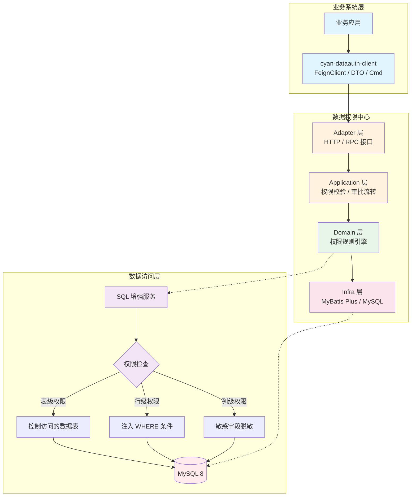
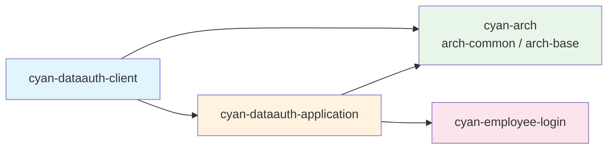
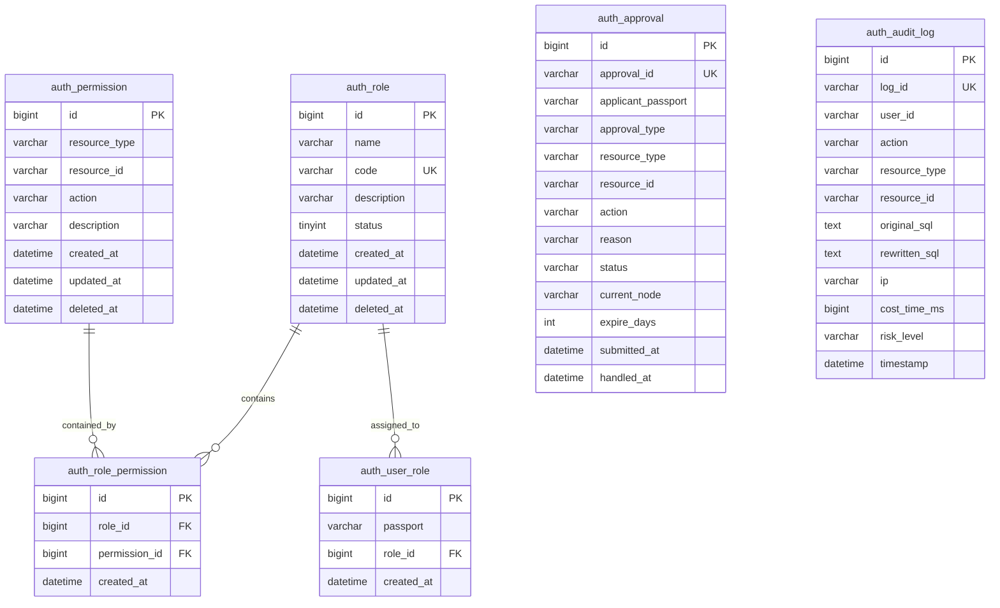

# cyan-dataauth — 数据权限中心

<p align="center">
  
  
  
  
  
  
</p>

<p align="center">
  <b>企业级数据权限管控平台，提供表级、行级、列级三维权限模型与运行时 SQL 增强能力。</b>
</p>

---

## 📖 项目简介

`cyan-dataauth` 是 Cyan 生态体系中的**数据权限中心**，采用 DDD（领域驱动设计）四层架构，专注于解决企业数据资产的多维度访问控制问题。系统对外提供标准化的权限申请审批流程，对内通过运行时 SQL 注入技术实现透明化的数据权限拦截，使业务系统无需感知权限逻辑即可安全访问数据。

**核心价值：**
- 🔒 **细粒度管控** — 从表、行、列三个维度精准控制数据访问范围
- ⚡ **无侵入集成** — 通过 SQL 增强服务运行时注入权限条件，业务代码零改造
- 📋 **流程化审批** — 内置权限申请、审批、授权全生命周期管理
- 🔍 **全链路审计** — 记录 SQL 改写、权限变更等关键操作，支持风险分级

---

## 🏗 权限模型架构



### 权限模型说明

| 权限维度 | 控制粒度 | 实现方式 | 典型场景 |
|---------|---------|---------|---------|
| **表级权限** | 数据表（Table） | 白名单/黑名单机制，控制用户可见的数据表范围 | 财务表仅对财务部门开放 |
| **行级权限** | 数据行（Row） | 运行时注入 `WHERE` 条件过滤 | 区域经理仅能看到本区域订单 |
| **列级权限** | 数据列（Column） | 敏感字段脱敏与访问控制 | 手机号脱敏、薪资字段隐藏 |

---

## 📦 模块说明

```
cyan-dataauth
├── cyan-dataauth-client          # 客户端 SDK（对外暴露）
│   ├── client/                   # FeignClient 接口定义
│   ├── cmd/                      # 命令对象（写操作入参）
│   └── dto/                      # 数据传输对象（读操作出参）
│
└── cyan-dataauth-application     # 应用服务（独立部署）
    ├── adapter/                  # 适配器层：HTTP Controller + RPC 接口
    ├── application/              # 应用层：服务编排、事务管理
    ├── domain/                   # 领域层：实体、领域服务、仓储接口
    │   ├── approval/             # 审批领域
    │   ├── audit/                # 审计领域
    │   ├── permission/           # 权限领域（含 PermissionChecker）
    │   └── role/                 # 角色领域
    └── infra/                    # 基础设施层：MyBatis Plus、数据库实现
        └── persistence/          # 持久化：DO / Mapper / RepositoryImpl
```

### 模块依赖关系



| 模块 | 职责 | 部署方式 |
|-----|------|---------|
| `cyan-dataauth-client` | 提供 FeignClient、DTO、Cmd，供上游业务系统依赖 | Maven 依赖 |
| `cyan-dataauth-application` | 权限中心应用服务，处理权限计算、审批流转、SQL 增强 | 独立服务部署 |

---

## 🛠 技术栈

| 技术 | 版本 | 说明 |
|-----|------|------|
| Java | 21 | 开发语言 |
| Spring Boot | 3.3.13 | 应用框架 |
| Spring Cloud OpenFeign | 4.1.1 | 服务间通信 |
| MyBatis Plus | 3.5.7 | ORM 框架 |
| MySQL | 8.3.0 | 关系型数据库 |
| MapStruct | — | 对象映射转换 |
| Lombok | 1.18.42 | 代码简化 |
| Maven | 3.x | 构建工具 |

---

## ✨ 核心功能

### 1. 表级权限
控制用户对数据表的访问范围。通过配置角色与数据表的绑定关系，实现"哪些表可见/可操作"的管控。

### 2. 行级权限
基于条件表达式的行数据过滤。系统运行时解析用户权限规则，自动向 SQL 注入 `WHERE` 条件，实现透明化的数据隔离。

> 例如：为区域经理注入 `region_code = 'R001'` 条件，确保只能查询本区域数据。

### 3. 列级权限
敏感字段的脱敏与访问控制。支持对指定列进行掩码处理（如手机号 `138****8888`）或完全隐藏，防止敏感信息泄露。

### 4. 权限申请审批流
提供标准化的权限申请工作流：
- **申请**：用户提交权限申请单（指标权限 / 数据权限 / 角色变更）
- **审批**：多级审批节点，支持通过/驳回，可配置权限有效期
- **授权**：审批通过后自动绑定角色-权限关系

### 5. SQL 增强服务
对内提供的核心能力，通过拦截业务 SQL，在运行时完成以下增强：
- 解析原始 SQL，提取涉及的数据表
- 查询当前用户的权限规则集合
- 动态拼接权限过滤条件（表级、行级、列级）
- 返回改写后的安全 SQL 并记录审计日志

---

## 🚀 快速开始

### 环境准备

- JDK 21+
- Maven 3.8+
- MySQL 8.0+

### 1. 克隆仓库

```bash
git clone git@github.com:cyan-daimao/cyan-dataauth.git
cd cyan-dataauth
```

### 2. 初始化数据库

```bash
# 创建数据库并执行初始化脚本
mysql -u root -p -e "CREATE DATABASE IF NOT EXISTS cyan_dataauth CHARACTER SET utf8mb4;"
mysql -u root -p cyan_dataauth < cyan-dataauth-application/src/main/resources/db/init.sql
```

> 脚本将创建以下核心表：
> - `auth_role` — 角色表
> - `auth_permission` — 权限项表
> - `auth_role_permission` — 角色-权限关联表
> - `auth_user_role` — 用户-角色关联表
> - `auth_approval` — 审批单表
> - `auth_audit_log` — 审计日志表

### 3. 配置应用

编辑 `cyan-dataauth-application/src/main/resources/bootstrap-dev.yml`，配置数据库连接：

```yaml
spring:
  datasource:
    url: jdbc:mysql://localhost:3306/cyan_dataauth?useUnicode=true&characterEncoding=utf8&serverTimezone=Asia/Shanghai
    username: root
    password: your_password
```

### 4. 编译构建

```bash
mvn clean install -DskipTests
```

### 5. 启动服务

```bash
cd cyan-dataauth-application
mvn spring-boot:run -Dspring-boot.run.profiles=dev
```

服务默认启动后，可通过以下方式验证：

```bash
# 健康检查
curl http://localhost:8080/actuator/health
```

### 6. 业务系统集成

在业务系统的 `pom.xml` 中引入客户端依赖：

```xml
<dependency>
    <groupId>com.cyan</groupId>
    <artifactId>cyan-dataauth-client</artifactId>
    <version>1.0-SNAPSHOT</version>
</dependency>
```

然后注入对应的 FeignClient 即可调用权限服务：

```java
@Autowired
private AuthCheckClient authCheckClient;

// 检查用户权限
AuthCheckResult result = authCheckClient.check(new AuthCheckCmd(...));

// 获取增强后的过滤 SQL
FilterSqlResult sqlResult = authCheckClient.filterSql(new FilterSqlCmd(...));
```

---

## 📄 数据库表结构



---

## 🤝 贡献指南

欢迎提交 Issue 和 Pull Request。请遵循以下规范：

- 代码风格遵循项目现有规范
- 提交信息使用 [Conventional Commits](https://www.conventionalcommits.org/) 规范
- 重大变更请先提交 Issue 讨论

---

## 📜 License

本项目采用 [MIT License](LICENSE) 开源协议。

---

<p align="center">
  <sub>Built with ❤️ by Cyan Team</sub>
</p>
